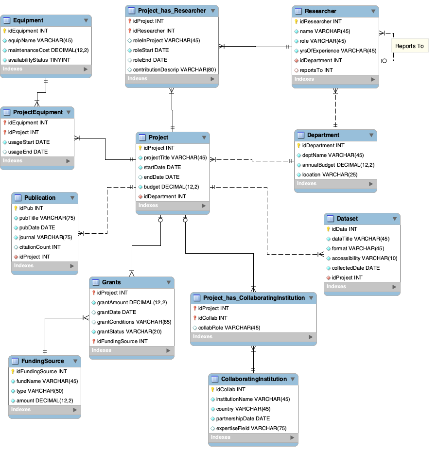

# University-Research-System
# Team Name:
Data Dash
# Team Members:
1. Vivian Aguirre [@vivianyaguirre](https://github.com/vivianyaguirre)
2. Lindsey Rubury [@lindseyrubury](https://github.com/lindseyrubury)
3. Sanvi Mamidipalli [@sanvimam](https://github.com/sanvimam)
# Scenario Description:
This data model represents the operational structure of a research organization, focusing on managing projects, researchers, equipment, funding, and collaborations. It tracks the lifecycle of research projects, including researcher roles, equipment usage, funding sources, and collaborations with external institutions, while also maintaining information on publications and datasets generated. Researchers are assigned specific roles, with their contributions tracked over time, and departments oversee projects, managing budgets and resources to ensure effective operations. The system supports grant management by linking projects to funding sources, detailing grant conditions, amounts, and statuses. Collaborative institutions contribute expertise or resources, while equipment usage is logged to ensure maintenance and availability. Publications and datasets are tied to projects, providing a comprehensive view of research outcomes and contributions to the scientific community. This model streamlines research operations, enabling effective resource management, collaboration, and performance monitoring, while offering insights into funding, resource utilization, and research outputs.
# Data Model:

The database model provides a robust framework to manage research activities by integrating relationships across projects, departments, researchers, equipment, funding, collaborations, outputs, and hierarchies. At its core, the Project entity serves as the central hub, capturing key information such as project titles, budgets, timelines, and departmental oversight.

### 1. Projects and Departments Relationship: 
Each project is associated with a department, represented through the relationship between the Project and Department entities. Departments oversee projects, manage resources like budgets, and provide locations for execution. This one-to-many relationship ensures that multiple projects can be supported by a single department, but each project is directly accountable to one department. 
### 2. Projects and Researchers Relationship:
Researchers are assigned specific roles in projects, with their involvement tracked through the Project_has_Researcher table. This many-to-many relationship links researchers to projects and records their roles, contributions, and timelines, ensuring comprehensive personnel management. Researchers are further connected to their departments, facilitating broader organizational tracking. The hierarchical structure among researchers is supported through a self-referential "Reports To" relationship within the Researcher entity, enabling the management of reporting chains and team leadership.
### 3. Projects and Equipment Relationship:
The use of equipment by projects is managed through the ProjectEquipment table, which establishes a many-to-many relationship between the Project and Equipment entities. This table captures equipment usage details, including start and end dates, maintenance costs, and availability, ensuring efficient resource allocation and proper planning.
### 4. Projects and Funding Relationship:
Projects are linked to funding through the Grants entity, which stores information on grant amounts, conditions, and statuses. This one-to-many relationship allows a project to receive multiple grants, although it is not mandatory for a project to have one. The FundingSource entity captures additional details about the sources of funding, such as their names, types, and total contributions, enabling transparent and detailed financial trackin
### 5. Projects and Collaborating Institutions Relationship:
Collaborations with external institutions are tracked using the "Project_has_CollaboratingInstitution" table, which connects the "Project" entity to the "CollaboratingInstitution" entity. This table records the role and nature of the collaboration, such as expertise provided or resources shared.
### 6. Projects and Publications Relationship:
The outcomes of research projects, such as publications, are captured through the "Publication" entity. This table links publications to specific projects and records details like publication titles, dates, journals, and citation counts.
### 7. Projects and Datasets Relationship:
Datasets generated during research activities are connected to projects through the "Dataset" entity. This table stores details about datasets, including titles, formats, accessibility, and collection dates, ensuring a comprehensive record of research outputs.
### 8. Researchers and Reporting Relationship:
The "Researcher" entity includes a self-referential relationship ("Reports To"), allowing the organization to track reporting hierarchies among researchers. This supports effective team management and organizational oversight.
### 9. Equipment Maintenance and Availability:
The "Equipment" entity tracks details such as equipment name, maintenance cost, and availability status, ensuring proper resource management and allocation for ongoing projects.
# Data Dictionary:
### Project Table

### Researcher Table

### Equipment Table

### Grants Table

### Publication Table

### Collaborating Institution Table

### Department Table

### Dataset Table

### Funding Source Table

### Project_has_Researcher Table

### Project_has_Collaborating Institution Table

### ProjectEquipment

# Queries for Insight:

### Query #1:  Retrieve a summary of all ongoing projects and their associated grants, showing the total grant amount, used budget so far, and remaining balance.

Q1 Managerial Perspective: This query focuses on how well the funds that are being allocated to active projects are actually being used. We do this by pulling the project title, its start and end dates, the total grant amount provided, the amount spent so far (titled as “used_budget”), and the remaining funds. By ordering these results from remaining balance descending, managers can quickly identify projects with unutilized funds and decide on necessary actions, such as redistributing resources or increasing expenditures to achieve project objectives.  (This query includes projects that are currently ongoing as of today)

### Query #2:  Retrieve a list of researchers and their projects, including the project title and the total grant funding received for each project, sorted by researcher name and project title.

Q2 Managerial Perspective: This query provides managers with a clear overview of researchers and project funding, helping them assess resource use and project priorities. By showing the total funding for each project and linking researchers to their work, it helps managers ensure resources are properly allocated and high-value projects get the necessary support. Additionally, this query helps identify areas where staffing or funding adjustments may be needed to align with company goals, supporting better decision-making and efficient project management.

### Query #3:  Calculate the total number of projects each researcher is involved in and their average years of experience in the department.

 

 Q3 Managerial Perspective: This query helps managers understand how researchers are distributed across projects and departments, showing their workload and average experience levels. It identifies overworked or underutilized researchers and highlights where expertise is concentrated. With these insights, managers can balance workloads, assign resources strategically, and ensure projects are supported by the right level of experience.

### Query #4:  Select the department name, project title, pending grant amount, grant date, and conditions from the corresponding tables, joining them by department and project IDs, and filter for projects with pending grants. Order by department name and project title.

Q4 Managerial Perspective: This query provides insights into projects that have pending grants and their associated departments, enabling managers to identify areas requiring attention regarding financial support. By allowing managers to see which departments have projects with pending grants and the specific details of those grants, it helps prioritize follow-ups and manage financial expectations. The results help track grant conditions and identify which projects are still awaiting approval or funding disbursement.

### Query #5:  Select the funding source name, project title, grant amount, and grant status from the Grants table, join the FundingSource table on the funding source ID, join the Project table on the project ID, and order the results by grant amount in descending order.

Q5 Managerial Perspective: This query offers a detailed view of grants, highlighting the funding sources, project titles, grant amounts, and grant statuses. By sorting the results by grant amount, it helps managers quickly identify which projects are receiving the most financial support. The inclusion of grant statuses provides insights into the current stage of each funding, allowing managers to track the progress of each grant and ensure timely follow-up on those still in process. Understanding the distribution of grant amounts across projects, along with the funding sources, supports more effective financial planning and resource allocation by revealing where the funding is coming from for each project.

# Tableau Visualizations and Dashboard:
## Visualization - Query #1:

### Description:
This visualization compares the used budget and allocated grant amount for different research projects, including "Machine Learning in Healthcare," "AI Research," "Quantum Mechanics," and "Organic Chemistry." The chart is divided into two sections: the upper chart shows the used budget for each project, while the lower chart displays the total allocated grant amount. Each project is represented by a distinct color, with a consistent color scheme across both sections for easy comparison.
### Justification:
This visualization is designed to provide insights into how effectively research projects utilize their allocated budgets. By comparing the used budget with the allocated grant amount, it highlights discrepancies between funding allocation and actual usage. For instance, "Machine Learning in Healthcare" shows a higher used budget compared to other projects, indicating significant resource utilization, while "Quantum Mechanics" appears to underutilize its allocated budget. This comparison enables stakeholders to assess financial efficiency, identify potential underfunding or overspending, and make informed decisions regarding future budget adjustments or reallocation. The clear color coding and split charts ensure readability and ease of interpretation.

## Visualization - Query #2:

### Description:
This bar chart, titled "Grant Funding by Research Project", visualizes the total grant funding allocated to various research projects. The x-axis represents the project titles, while the y-axis indicates the total funding amounts in USD. Each bar corresponds to a specific research project, with its height reflecting the funding received. The visualization highlights projects such as "Cancer Research," "Genetics Study," and "Machine Learning in Healthcare" as having received higher levels of funding compared to others like "Climate Change" and "Number Theory."
### Justification:
This visualization effectively highlights the distribution of grant funding across various research projects, making it easy to compare funding levels at a glance. By using a bar chart, the visualization provides a clear and intuitive way to identify the most and least funded projects, such as "Cancer Research" and "Genetics Study" receiving the highest funding, while areas like "Climate Change" receive less. This allows stakeholders to quickly assess funding priorities and make informed decisions about reallocating resources or justifying current allocations, ensuring alignment with organizational goals and research priorities.

## Visualization - Query #5:

### Description:
This bar chart, titled "Grant Distribution by Funding Source and Status", visualizes the grant amounts contributed by various funding sources such as Facebook AI, Ford Foundation, NASA, WHO, and others. The bars are color-coded based on the Grant Status—Active (blue), Complete (orange), and Pending (red). The x-axis represents the funding sources, while the y-axis displays the grant amounts. The chart allows for a side-by-side comparison of funding levels and their current statuses for each source.
### Justification:
This visualization is designed to provide insights into the contribution levels and grant statuses from different funding sources. By using a color-coded scheme, it effectively highlights the proportion of grants that are active, completed, or pending, helping stakeholders understand the current progress and pipeline of grants. For instance, funding from sources like NASA and the National Science Foundation is predominantly active, while WHO shows a higher proportion of completed grants. The visualization also identifies pending grants (e.g., Ford Foundation and UNICEF), which may require follow-up or intervention. This chart aids in monitoring grant performance and assessing which funding sources are the most reliable or require attention for grant activation.

## Dashboard

### Description:
This dashboard combines three visualizations to provide a comprehensive analysis of grant funding distribution, usage, and status across projects and funding sources.
 - Grant Funding by Research Project: The top-left chart shows the total grant funding allocated to various research projects, highlighting significant allocations to projects like "Cancer Research" and "Genetics Study."
- Comparison of Used vs. Allocated Grant Budgets Across Projects: The top-right chart compares the allocated grant amount with the actual used budget for specific projects such as "Machine Learning in Healthcare," "AI Research," and "Organic Chemistry," identifying disparities in budget utilization.
- Grant Distribution by Funding Source and Status: The bottom chart displays grant contributions from different funding sources (e.g., NASA, WHO, Facebook AI) and their statuses (Active, Complete, or Pending), using color-coded bars for clarity.
### Justification:
This dashboard provides a multidimensional perspective on grant management, enabling stakeholders to analyze funding allocation, utilization, and source reliability effectively.
- Allocation and Utilization Insights: By comparing allocated and used budgets, stakeholders can assess whether projects are under- or over-utilizing their funds, aiding in financial planning and resource optimization.
- Funding Source Performance: The grant status breakdown identifies reliable funding sources (e.g., NASA with predominantly active grants) and areas requiring follow-up, such as pending grants from the Ford Foundation.
- Project Prioritization: The funding distribution chart highlights which research areas receive the most financial support, helping to align funding priorities with organizational goals.

## Database Information
Name of the database: cs_vya95458

